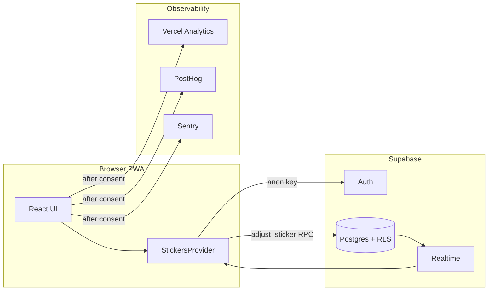

# Meu Álbum 2026

Progressive web app to track your **Panini FIFA World Cup 2026** sticker collection — mark cards, share missing lists, match trades with friends, and sync everything to your account in the cloud.

**Live stack:** React 18 · TypeScript · Vite 8 · Tailwind CSS · Supabase · Vercel

---

## Features

| Area | What you get |
|------|----------------|
| **Album** | All 48 nations in Panini print order, plus opening (`FWC 01–08`), history (`FWC 09–19`), and Coca-Cola exclusives (`CC`) — **994 stickers** total |
| **Marking** | Tap to add · tap again to remove · duplicate badge (`+N`) · wide cards for specials |
| **Missing** | Grouped list of what you still need · one-tap **WhatsApp** share with flags |
| **Trade matcher** | Paste a friend's duplicate list · instant cross-match with your missing/swaps |
| **Swaps** | All duplicates by team · share extras the same way |
| **QR trade** | Generate a link/QR with your swaps for in-person meetups (`/trade`) |
| **Dashboard** | Album %, shortcuts, recent milestones, challenge preview |
| **Challenges** | Themed goals (groups, teams, album %) with shareable completion cards |
| **Milestones** | Unlock celebrations at album/team thresholds |
| **Onboarding** | First-session guided tour (feature-flagged) across the core loop |
| **Account** | Magic link or Google · realtime sync · CSV export · album reset · account deletion |
| **PWA** | Installable on mobile/desktop · catalog cached after first load |
| **i18n** | pt-BR · en · es |

Scanner / OCR is **out of MVP scope** and not wired into the main app.

---

## Tech stack

| Layer | Tools |
|-------|--------|
| **UI** | React 18, React Router 7, Tailwind CSS 3 |
| **Build** | Vite 8, TypeScript 5, `@vitejs/plugin-react` |
| **Data** | Supabase Auth, Postgres, Realtime, RLS, `adjust_sticker` RPC |
| **PWA** | `vite-plugin-pwa` |
| **Analytics** | Vercel Analytics, PostHog (product events, feature flags) |
| **Errors** | Sentry (after LGPD consent) |
| **Quality** | ESLint 9, Vitest 4, Testing Library, Playwright |
| **CI** | GitHub Actions · deploy on Vercel |

**Runtime:** Node **24.15+** · npm **11+** (see `.nvmrc`)

---

## Project structure

```
copado26web/
├── src/
│   ├── main.tsx, App.tsx, AppAuthGate.tsx     # Entry, routing, auth gate
│   ├── AuthenticatedApp.tsx                   # Shell: header, tabs, onboarding
│   ├── AuthenticatedRoutes.tsx                # Logged-in routes (lazy pages)
│   ├── pages/                                 # Album, Missing, Swaps, Dashboard, …
│   ├── components/                            # UI + onboarding/
│   ├── state/                                 # StickersProvider, store, realtime
│   ├── hooks/                                 # Auth, stickers, challenges, milestones
│   ├── lib/                                   # supabase, telemetry, share, trade parse
│   ├── i18n/locales/                          # pt-BR.json · en.json · es.json
│   └── types/                                 # DB-aligned TypeScript types
├── supabase/migrations/                       # Versioned Postgres schema
├── e2e/                                       # Playwright (public + authenticated)
├── scripts/                                   # PostHog metrics, Sentry triage, AI harness
├── docs/                                      # MVP observability, E2E, security, LGPD
├── ai/                                        # Agent personas, specs, internal docs
└── .github/workflows/                         # check · e2e · metrics · triage
```

### App routes

| Route | Access | Purpose |
|-------|--------|---------|
| `/` | Public | Marketing landing |
| `/album` | Public (guest) / Auth | Sticker grid (paywall when guest) |
| `/login` | Public | Magic link + Google |
| `/trade` | Public / Auth | Trade link from QR or share |
| `/dashboard` | Auth | Home · progress · challenges preview |
| `/album` | Auth | Full album with sidebar |
| `/missing` | Auth | Missing list + share + paste matcher |
| `/swaps` | Auth | Duplicates |
| `/challenges` | Auth | All themed challenges |
| `/settings` | Auth | Export, consent, sign-out, delete account |
| `/privacidade`, `/termos` | Public | Privacy · Terms |

Default after login: **`/dashboard`**.

---

## How it works (data flow)



- **Catalog** (`teams`, `stickers_catalog`) is shared read-only data.
- **User state** (`user_stickers`) is sparse rows keyed by `auth.uid()`; RLS enforces ownership.
- **Writes** go through `adjust_sticker(sticker_id, delta)` so increment/decrement never races.

---

## Getting started

### Prerequisites

- [Node.js](https://nodejs.org/) 24.15+ (use `nvm use` — `.nvmrc` is provided)
- npm 11+
- A [Supabase](https://supabase.com) project (free tier is fine)

### Install & run

```bash
git clone https://github.com/marcelotust/copado26web.git
cd copado26web
npm install
cp .env.example .env.local   # add Supabase URL + anon key
npm run dev
```

Open **http://localhost:5173**.

### Production build

```bash
npm run build      # tsc + vite build
npm run preview    # serve dist/
```

---

## Environment variables

Copy [`.env.example`](.env.example) to `.env.local` for local dev.

| Variable | Required | Purpose |
|----------|:--------:|---------|
| `VITE_SUPABASE_URL` | ✅ | Supabase project URL |
| `VITE_SUPABASE_ANON_KEY` | ✅ | Public anon key — security is RLS, not key secrecy |
| `VITE_APP_URL` | — | Canonical origin for share/trade links (defaults to `window.location.origin`) |
| `VITE_SENTRY_DSN` | — | Error reporting (only after analytics consent) |
| `VITE_SENTRY_RELEASE` | — | Release label for Sentry |
| `VITE_POSTHOG_KEY` | — | Product analytics & feature flags (e.g. onboarding) |
| `VITE_POSTHOG_HOST` | — | PostHog ingest host (default: `https://us.i.posthog.com`) |

**Vercel build-only** (source maps): `SENTRY_AUTH_TOKEN`, `SENTRY_ORG`, `SENTRY_PROJECT` — see [docs/setup-sentry-posthog.md](docs/setup-sentry-posthog.md).

Never commit a `service_role` key. CI uses placeholder Supabase values for build and public E2E.

---

## Database setup

Schema lives in [`supabase/migrations/`](supabase/migrations/).

```bash
npm install -g supabase
supabase link --project-ref <your-project-ref>
supabase db push
```

Creates:

- `teams` — 51 entries (48 nations + `WAP`, `FWC`, `CC`)
- `stickers_catalog` — 994 stickers
- `user_stickers` — per-user quantities, RLS-scoped
- `adjust_sticker` — atomic upsert/increment RPC

Sanity check:

```sql
select count(*) from public.teams;             -- 51
select count(*) from public.stickers_catalog;  -- 994
```

Production checklist: [docs/supabase-production-security.md](docs/supabase-production-security.md).

---

## Scripts

| Command | Description |
|---------|-------------|
| `npm run dev` | Vite dev server (port 5173) |
| `npm run build` | Typecheck + production bundle |
| `npm run preview` | Preview production build |
| `npm run lint` | ESLint on `src/` |
| `npm run typecheck` | `tsc --noEmit` |
| `npm run test` / `test:ci` | Vitest unit & component tests |
| `npm run test:watch` | Vitest watch mode |
| `npm run test:e2e:public` | Playwright public smoke (no secrets) |
| `npm run test:e2e:auth` | Playwright authenticated suite |
| `npm run ai:harness` | Suggest CI gates from changed files |
| `npm run posthog:metrics-check` | Activation/retention digest (needs PostHog API) |
| `npm run sentry:triage` | Sentry issue triage helper |

Pre-commit (Husky + lint-staged): ESLint + `tsc` on staged `src/**/*.{ts,tsx}`.

---

## Testing & CI

| Workflow | Trigger | What it runs |
|----------|---------|----------------|
| [`check`](.github/workflows/check.yml) | PR + `main` | typecheck · lint · Vitest · build |
| [`e2e`](.github/workflows/e2e.yml) | PR + `main` | Playwright **public** smoke (`smoke` required) |
| [`e2e-authenticated`](.github/workflows/e2e-authenticated.yml) | Scheduled / manual | Full auth E2E (secrets) |
| [`posthog-metrics-check`](.github/workflows/posthog-metrics-check.yml) | Scheduled | Metrics digest |
| [`sentry-triage`](.github/workflows/sentry-triage.yml) | Scheduled | Error triage |

Details: [docs/e2e.md](docs/e2e.md).

---

## Deploy (Vercel)

1. Import the GitHub repo → framework preset **Vite**.
2. Set env vars for Preview + Production (`VITE_SUPABASE_*`, optional Sentry/PostHog).
3. Deploy — [`vercel.json`](vercel.json) configures headers and caching.

```bash
npx vercel          # preview
npx vercel --prod   # production
```

---

## Documentation

| Doc | Topic |
|-----|--------|
| [docs/mvp-quality-and-observability.md](docs/mvp-quality-and-observability.md) | Event taxonomy, Sentry, LGPD consent |
| [docs/mvp-activation-retention.md](docs/mvp-activation-retention.md) | Activation & retention metrics |
| [docs/setup-sentry-posthog.md](docs/setup-sentry-posthog.md) | Sentry + PostHog setup |
| [docs/e2e.md](docs/e2e.md) | Playwright projects & secrets |
| [docs/supabase-production-security.md](docs/supabase-production-security.md) | Production Supabase checklist |
| [AGENTS.md](AGENTS.md) | AI/agent operating contract for this repo |

---

## License

MIT
