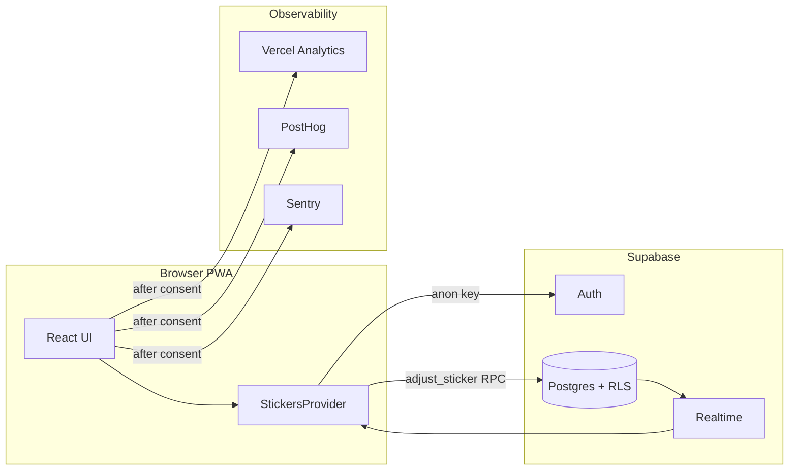

# Meu Álbum 2026

Progressive web app to track your **Panini FIFA World Cup 2026** sticker collection — mark cards, share missing lists, match trades with friends, and sync everything to your account in the cloud.

**Live stack:** React 18 · TypeScript · Vite 8 · Tailwind CSS · Supabase · Vercel

---

## Features

| Area | What you get |
|------|----------------|
| **Album** | All 48 nations in Panini print order, plus opening (`FWC 01–08`), history (`FWC 09–19`), and Coca-Cola exclusives (`CC`) — **994 stickers** total |
| **Marking** | Tap to add · tap again to remove · duplicate badge (`+N`) · wide cards for specials |
| **Missing** | Grouped list of what you still need · one-tap **WhatsApp** share with flags |
| **Trade matcher** | Paste a friend's duplicate list · instant cross-match with your missing/swaps |
| **Swaps** | All duplicates by team · share extras the same way |
| **QR trade** | Generate a link/QR with your swaps for in-person meetups (`/trade`) |
| **Dashboard** | Album %, shortcuts, recent milestones, challenge preview |
| **Challenges** | Themed goals (groups, teams, album %) with shareable completion cards |
| **Milestones** | Unlock celebrations at album/team thresholds |
| **Onboarding** | First-session guided tour (feature-flagged) across the core loop |
| **Account** | Magic link or Google · realtime sync · CSV export · album reset · account deletion |
| **PWA** | Installable on mobile/desktop · catalog cached after first load |
| **i18n** | pt-BR · en · es |

Scanner / OCR is **out of MVP scope** and not wired into the main app.

---

## Tech stack

| Layer | Tools |
|-------|--------|
| **UI** | React 18, React Router 7, Tailwind CSS 3 |
| **Build** | Vite 8, TypeScript 5, `@vitejs/plugin-react` |
| **Data** | Supabase Auth, Postgres, Realtime, RLS, `adjust_sticker` RPC |
| **PWA** | `vite-plugin-pwa` |
| **Analytics** | Vercel Analytics, PostHog (product events, feature flags) |
| **Errors** | Sentry (after LGPD consent) |
| **Quality** | ESLint 9, Vitest 4, Testing Library, Playwright |
| **CI** | GitHub Actions · deploy on Vercel |

**Runtime:** Node **24.15+** · npm **11+** (see `.nvmrc`)

---

## Project structure

```
copado26web/
├── src/
│   ├── main.tsx, App.tsx, AppAuthGate.tsx     # Entry, routing, auth gate
│   ├── AuthenticatedApp.tsx                   # Shell: header, tabs, onboarding
│   ├── AuthenticatedRoutes.tsx                # Logged-in routes (lazy pages)
│   ├── pages/                                 # Album, Missing, Swaps, Dashboard, …
│   ├── components/                            # UI + onboarding/
│   ├── state/                                 # StickersProvider, store, realtime
│   ├── hooks/                                 # Auth, stickers, challenges, milestones
│   ├── lib/                                   # supabase, telemetry, share, trade parse
│   ├── i18n/locales/                          # pt-BR.json · en.json · es.json
│   └── types/                                 # DB-aligned TypeScript types
├── supabase/migrations/                       # Versioned Postgres schema
├── e2e/                                       # Playwright (public + authenticated)
├── scripts/                                   # PostHog metrics, Sentry triage, AI harness
├── docs/                                      # MVP observability, E2E, security, LGPD
├── ai/                                        # Agent personas, specs, internal docs
└── .github/workflows/                         # check · e2e · metrics · triage
```

### App routes

| Route | Access | Purpose |
|-------|--------|---------|
| `/` | Public | Marketing landing |
| `/album` | Public (guest) / Auth | Sticker grid (paywall when guest) |
| `/login` | Public | Magic link + Google |
| `/trade` | Public / Auth | Trade link from QR or share |
| `/dashboard` | Auth | Home · progress · challenges preview |
| `/album` | Auth | Full album with sidebar |
| `/missing` | Auth | Missing list + share + paste matcher |
| `/swaps` | Auth | Duplicates |
| `/challenges` | Auth | All themed challenges |
| `/settings` | Auth | Export, consent, sign-out, delete account |
| `/privacidade`, `/termos` | Public | Privacy · Terms |

Default after login: **`/dashboard`**.

---

## How it works (data flow)



- **Catalog** (`teams`, `stickers_catalog`) is shared read-only data.
- **User state** (`user_stickers`) is sparse rows keyed by `auth.uid()`; RLS enforces ownership.
- **Writes** go through `adjust_sticker(sticker_id, delta)` so increment/decrement never races.

---

## Getting started

### Prerequisites

- [Node.js](https://nodejs.org/) 24.15+ (`nvm use` — see `.nvmrc`)
- npm 11+
- A [Supabase](https://supabase.com) project (free tier is fine)

### Install

```bash
git clone https://github.com/marcelotust/copado26web.git
cd copado26web
npm install
cp .env.example .env.local
```

Fill in **at minimum** `VITE_SUPABASE_URL` and `VITE_SUPABASE_ANON_KEY` (see [Environment variables](#environment-variables)).

### Run locally

```bash
npm run dev          # Vite → http://localhost:5173
```

| Goal | Command |
|------|---------|
| Production-like bundle | `npm run build && npm run preview` |
| Typecheck only | `npm run typecheck` |
| Lint only | `npm run lint` |
| Unit tests (CI mode) | `npm run test:ci` |
| Unit tests (watch) | `npm run test:watch` |
| Public E2E smoke | See [E2E tests](#e2e-tests-playwright) |
| Pick quality gates from your diff | `npm run ai:harness` |

**First login:** open `/login`, use magic link or Google. Catalog + your stickers load after auth; realtime updates apply across tabs.

**Guest mode:** `/album` works without login (paywall on sticker tap). Public E2E relies on stubbed Supabase — no real project needed.

### Local dev telemetry

| Tool | In dev | Notes |
|------|:------:|-------|
| **Sentry** | Off | Hard-disabled via `import.meta.env.DEV` |
| **PostHog** | Off | Same dev gate as Sentry — skipped even if `VITE_POSTHOG_KEY` is set |
| **Claude Code LLM** | CLI only | Optional PostHog plugin — see [docs/claude-code-llm-analytics.md](docs/claude-code-llm-analytics.md) |
| **Vercel Analytics** | Debug only | Uses Vercel’s dev script (console), not production dashboards |
| **Logger** | Console only | `debug` / `info` / `warn` / `error` locally — Sentry only in prod + consent |

Optional Sentry/PostHog keys in `.env.local` matter for **preview/production** or `npm run build && npm run preview`. Landing A/B works locally via `getAnonVariant` and `?hero=control|treatment` on `/`.

---

## Environment variables

Copy [`.env.example`](.env.example) to `.env.local` for local development. It lists every `VITE_*` the app reads plus commented E2E-only vars (shell / GitHub Actions, not loaded by Vite).

### App (`.env.local`)

| Variable | Required | Purpose |
|----------|:--------:|---------|
| `VITE_SUPABASE_URL` | ✅ | Supabase project URL |
| `VITE_SUPABASE_ANON_KEY` | ✅ | Public anon key — security is RLS, not key secrecy |
| `VITE_APP_URL` | — | Canonical origin for share/trade links (defaults to `window.location.origin`) |
| `VITE_SENTRY_DSN` | — | Error reporting (prod/preview; consent-gated; **off in dev**) |
| `VITE_SENTRY_RELEASE` | — | Release label for Sentry |
| `VITE_POSTHOG_KEY` | — | Product analytics & feature flags (**off in dev**) |
| `VITE_POSTHOG_HOST` | — | PostHog ingest host (default: `https://us.i.posthog.com`) |

Full setup walkthrough: [docs/setup-sentry-posthog.md](docs/setup-sentry-posthog.md).

### Vercel (build / deploy)

| Variable | When | Purpose |
|----------|------|---------|
| `VITE_SUPABASE_*` | Runtime | Same as local |
| `VITE_SENTRY_DSN` | Runtime | Optional errors |
| `VITE_POSTHOG_KEY` | Runtime | Optional analytics |
| `SENTRY_AUTH_TOKEN` | **Build only** | Upload source maps |
| `SENTRY_ORG`, `SENTRY_PROJECT` | **Build only** | Sentry plugin |
| `VERCEL_GIT_COMMIT_SHA` | Build | Auto-set; used as Sentry release |

### E2E (shell env — for local runs; CI uses [GitHub secrets](#repository-secrets))

| Variable | Public E2E | Auth E2E |
|----------|:----------:|:--------:|
| `VITE_SUPABASE_URL` | Placeholder OK | Test project URL |
| `VITE_SUPABASE_ANON_KEY` | Placeholder OK | Test anon key |
| `E2E_TEST_EMAIL` | — | ✅ |
| `E2E_TEST_PASSWORD` | — | ✅ |
| `E2E_SUPABASE_SERVICE_ROLE_KEY` | — | Optional (auto-create user) |
| `PLAYWRIGHT_PORT` | — | Default `5190` (dev server) |
| `PLAYWRIGHT_BASE_URL` | — | Override base URL |
| `E2E_FORCE_AUTH` | — | `1` to run auth project without full secrets (CI) |

Never commit a `service_role` key in the repo. CI build + public E2E use placeholders:

```bash
VITE_SUPABASE_URL=https://placeholder.supabase.co
VITE_SUPABASE_ANON_KEY=placeholder-anon-key
```

---

## Database setup

Schema lives in [`supabase/migrations/`](supabase/migrations/).

```bash
npm install -g supabase
supabase link --project-ref <your-project-ref>
supabase db push
```

Creates:

- `teams` — 51 entries (48 nations + `WAP`, `FWC`, `CC`)
- `stickers_catalog` — 994 stickers
- `user_stickers` — per-user quantities, RLS-scoped
- `adjust_sticker` — atomic upsert/increment RPC

Sanity check:

```sql
select count(*) from public.teams;             -- 51
select count(*) from public.stickers_catalog;  -- 994
```

Production checklist: [docs/supabase-production-security.md](docs/supabase-production-security.md).

---

## Unit & component tests (Vitest)

Stack: **Vitest** + **React Testing Library** + **jsdom**. Tests live next to source (`*.test.ts`, `*.test.tsx`) and under `src/test/`.

```bash
npm run test:ci      # single run, verbose (same as CI)
npm run test         # single run, default reporter
npm run test:watch   # watch mode while developing
npm run test:coverage
```

What to test where:

| Change type | Where to add tests |
|-------------|-------------------|
| Pure logic, parsers, telemetry, reducers | `src/**/*.test.ts` near the module |
| React behavior | `src/**/*.test.tsx` with Testing Library |

Pre-commit hook runs **ESLint + `tsc`** on staged `src/**/*.{ts,tsx}` (via Husky + lint-staged).

---

## E2E tests (Playwright)

Stack: **Playwright** with three projects — `public`, `setup`, `authenticated`. Config: [`playwright.config.ts`](playwright.config.ts). Specs: [`e2e/`](e2e/).

| Project | Runs on | Secrets |
|---------|---------|---------|
| `public` | Every PR (`e2e` workflow) | None |
| `authenticated` | Nightly / manual (`e2e-authenticated`) | Supabase test user |

### Public E2E (no Supabase project needed)

```bash
npx playwright install chromium
npm run build
VITE_SUPABASE_URL=https://placeholder.supabase.co \
VITE_SUPABASE_ANON_KEY=placeholder-anon-key \
  npm run test:e2e:public
```

Without a prior build, Playwright starts Vite dev on port **5190** (`PLAYWRIGHT_PORT`). CI builds first, then uses `vite preview`.

Covers: landing, guest `/album`, login form. Stubs auth/catalog; blocks service workers.

### Authenticated E2E (dedicated test Supabase)

Use a **separate** Supabase project — never production.

```bash
export VITE_SUPABASE_URL=https://xxx.supabase.co
export VITE_SUPABASE_ANON_KEY=eyJ...
export E2E_TEST_EMAIL=e2e@your-test-domain.com
export E2E_TEST_PASSWORD='strong-test-password'
# optional: E2E_SUPABASE_SERVICE_ROLE_KEY=eyJ...

npm run test:e2e:auth    # setup + authenticated specs
# npm run test:e2e       # full suite when env is complete
```

Session is stored in `e2e/.auth/user.json` (gitignored). Covers: album +/- sticker, tabs, settings export, analytics toggle, challenges.

More detail: [docs/e2e.md](docs/e2e.md).

---

## AI-assisted development

This repo is set up for **spec-driven, agent-assisted** work — prompts and verification live in git, not only in chat history.

| Path | Purpose |
|------|---------|
| [`AGENTS.md`](AGENTS.md) | Repo-wide contract: stack, boundaries, **Agent Safety**, **Definition of Done**, workflow, testing rules |
| [`ai/README.md`](ai/README.md) | Harness overview and default workflows |
| [`ai/CONVENTIONS.md`](ai/CONVENTIONS.md) | Branch, commit, PR conventions |
| [`ai/ROADMAP.md`](ai/ROADMAP.md) | Deferred workflow improvements with retake triggers |
| [`ai/agents/`](ai/agents/) | Personas (QA, telemetry, Supabase, product spec, …) — imperative form |
| [`ai/specs/`](ai/specs/) | Feature specs from `ai/specs/_template/` |
| [`scripts/ai-harness.mjs`](scripts/ai-harness.mjs) | Classify changed files → recommend quality gates |
| [`.cursor/rules/`](.cursor/rules/) | Cursor entry point + glob-scoped rules for sensitive paths |
| [`scripts/ai-hooks/`](scripts/ai-hooks/) | Shared agent hooks (git guard, harness on edit/stop) used by Claude, Cursor, and Codex |
| [`.claude/`](.claude/) | Claude Code agents, commands, skills, and hook wiring |
| [`.cursor/hooks.json`](.cursor/hooks.json) | Cursor hook wiring → `scripts/ai-hooks/` |
| [`.codex/hooks.json`](.codex/hooks.json) | Codex hook wiring → `scripts/ai-hooks/` |
| [`.github/CODEOWNERS`](.github/CODEOWNERS) | Owner review required for `AGENTS.md`, personas, harness, workflows, husky, `.claude/` |
| [`.github/pull_request_template.md`](.github/pull_request_template.md) | Canonical PR body shape |
| [`.husky/`](.husky/) | Local guards: pre-commit (lint-staged + branch guard), pre-push (lint + harness + force-push guard) |
| [`docs/repo-setup.md`](docs/repo-setup.md) | GitHub-side branch protection + required secrets |
| [`docs/claude-code-llm-analytics.md`](docs/claude-code-llm-analytics.md) | Capture Claude Code sessions in PostHog LLM Analytics |

### Quick workflow

**Small fix**

1. Read nearby code + tests.
2. Implement the smallest coherent change.
3. Run `npm run ai:harness` → run the gates it recommends (or document why skipped).

**Feature / ambiguous product change**

1. Copy `ai/specs/_template/` → `ai/specs/YYYY-MM-DD-short-slug/`.
2. Fill `spec.md` before coding.
3. Implement in slices; update `verification.md` with commands run.

**Run recommended gates automatically**

```bash
npm run ai:harness          # print recommended gates from git diff
npm run ai:harness -- --run # execute them (lint, test:ci, build, e2e:public, …)
npm run ai:harness -- --all # classify entire repo
```

The pre-push hook in [`.husky/pre-push`](.husky/pre-push) runs `lint` and `ai:harness` automatically before every push. Claude Code, Cursor, and Codex users get the same guards via [`scripts/ai-hooks/`](scripts/ai-hooks/) (wired in [`.claude/settings.json`](.claude/settings.json), [`.cursor/hooks.json`](.cursor/hooks.json), [`.codex/hooks.json`](.codex/hooks.json)).

Agents must satisfy [`AGENTS.md` → Definition of Done](AGENTS.md#definition-of-done) before declaring a task complete, and follow the rules in [`AGENTS.md` → Agent Safety](AGENTS.md#agent-safety) for handling untrusted content, secrets, and dangerous git operations.

Product boundaries agents must respect: no scanner/OCR in MVP unless asked; UI copy via `src/i18n/locales/*.json`; analytics only after LGPD consent; never ship `service_role` keys in the client.

---

## Scripts reference

| Command | Description |
|---------|-------------|
| `npm run dev` | Vite dev server (port 5173) |
| `npm run build` | Typecheck + production bundle |
| `npm run preview` | Preview production build |
| `npm run lint` | ESLint on `src/` |
| `npm run typecheck` | `tsc --noEmit` |
| `npm run test` / `test:ci` | Vitest |
| `npm run test:watch` | Vitest watch |
| `npm run test:e2e:public` | Playwright public smoke |
| `npm run test:e2e:auth` | Playwright authenticated |
| `npm run test:e2e` | Full Playwright suite (needs auth env) |
| `npm run ai:harness` | Changed-file gate recommender |
| `npm run posthog:metrics-check` | Activation/retention digest (PostHog API) |
| `npm run sentry:triage` | Sentry triage helper |

---

## GitHub Actions & secrets

Workflows live in [`.github/workflows/`](.github/workflows/).

### Workflows

| Workflow | File | Trigger | Merge gate | What it does |
|----------|------|---------|:----------:|--------------|
| **check** | [`check.yml`](.github/workflows/check.yml) | PR · push `main` | ✅ | `npm run typecheck` · `lint` · `test:ci` · `build` (placeholder Supabase) |
| **e2e** (`smoke`) | [`e2e.yml`](.github/workflows/e2e.yml) | PR · push `main` | ✅ | Build + Playwright **public** project; uploads report on failure |
| **gitleaks** | [`gitleaks.yml`](.github/workflows/gitleaks.yml) | PR · push `main` | ✅ | Scan diff for committed secrets (`gitleaks-action@v2`) |
| **e2e-authenticated** | [`e2e-authenticated.yml`](.github/workflows/e2e-authenticated.yml) | Daily 06:00 UTC · manual | — | Playwright **authenticated** suite against test Supabase (skipped if secrets missing) |
| **posthog-metrics-check** | [`posthog-metrics-check.yml`](.github/workflows/posthog-metrics-check.yml) | Daily 09:15 UTC · manual | — | `npm run posthog:metrics-check` — activation/retention alerts + daily digest commit |
| **sentry-triage** | [`sentry-triage.yml`](.github/workflows/sentry-triage.yml) | Daily 09:00 UTC · manual | — | `npm run sentry:triage` — opens GitHub issues for critical production Sentry errors |

PRs must pass **check** + **e2e (smoke)** + **gitleaks**. Branch protection settings are documented in [`docs/repo-setup.md`](docs/repo-setup.md). Vercel deploys preview/production separately (not a GitHub Actions job in this repo).

### Repository secrets

Configure under **GitHub → Settings → Secrets and variables → Actions → Secrets**.

| Secret | Used by | Purpose |
|--------|---------|---------|
| `VITE_SUPABASE_URL` | `e2e-authenticated` | Supabase **test** project URL (also set on Vercel for deploy) |
| `VITE_SUPABASE_ANON_KEY` | `e2e-authenticated` | Test project anon key (also on Vercel) |
| `E2E_TEST_EMAIL` | `e2e-authenticated` | Dedicated E2E user email |
| `E2E_TEST_PASSWORD` | `e2e-authenticated` | E2E user password |
| `E2E_SUPABASE_SERVICE_ROLE_KEY` | `e2e-authenticated` | Optional — create/reset test user via Admin API |
| `SENTRY_AUTH_TOKEN` | `sentry-triage` | Sentry API token ([setup](docs/setup-sentry-posthog.md)) |
| `POSTHOG_PERSONAL_API_KEY` | `posthog-metrics-check` | PostHog personal key with **Query Read** scope |
| `POSTHOG_PROJECT_ID` | `posthog-metrics-check` | PostHog project ID |

**Not required for PR CI:** `check` and `e2e` use inline placeholder Supabase values. **Never** add `service_role` keys to client `VITE_*` vars.

### Repository variables

Configure under **Settings → Secrets and variables → Actions → Variables** (non-sensitive).

| Variable | Used by | Default | Purpose |
|----------|---------|---------|---------|
| `POSTHOG_HOST` | `posthog-metrics-check` | `https://us.posthog.com` | PostHog **API** host (not the ingest `us.i.posthog.com` URL) |

### Built-in / workflow env

| Name | Source | Used by |
|------|--------|---------|
| `GITHUB_TOKEN` | Auto (per run) | `posthog-metrics-check`, `sentry-triage` | Create issues, commit digest, API calls |
| `github.token` | Checkout / permissions | `posthog-metrics-check` | Write `docs/metricas/` digest commits |

**`sentry-triage`** also sets fixed env in the workflow: `SENTRY_ORG=meualbum2026`, `SENTRY_PROJECT=meu-album-2026-app`, query/stats filters — see [`.github/workflows/sentry-triage.yml`](.github/workflows/sentry-triage.yml).

**`e2e-authenticated`** sets `E2E_FORCE_AUTH=1` and `CI=true` when running the auth suite.

### Vercel (deploy secrets)

Not stored in GitHub Actions — set in the **Vercel project** for Preview + Production:

| Variable | Required |
|----------|:--------:|
| `VITE_SUPABASE_URL` | ✅ |
| `VITE_SUPABASE_ANON_KEY` | ✅ |
| `VITE_SENTRY_DSN` | optional |
| `VITE_POSTHOG_KEY` | optional |
| `SENTRY_AUTH_TOKEN` | Build only (source maps) |
| `SENTRY_ORG`, `SENTRY_PROJECT` | Build only |

See [Deploy (Vercel)](#deploy-vercel) and [docs/setup-sentry-posthog.md](docs/setup-sentry-posthog.md).

### Run scheduled workflows locally

Same scripts as CI; export the matching secrets first (see [docs/metricas/README.md](docs/metricas/README.md) for PostHog):

```bash
npm run sentry:triage
npm run posthog:metrics-check -- --dry-run   # no issues/commit
```

### Pre-PR checklist (mirrors merge gates)

```bash
npm run ai:harness -- --run
# or manually:
npm run typecheck && npm run lint && npm run test:ci && npm run build
VITE_SUPABASE_URL=https://placeholder.supabase.co VITE_SUPABASE_ANON_KEY=placeholder-anon-key npm run test:e2e:public
```

---

## Deploy (Vercel)

1. Import the GitHub repo → framework preset **Vite**.
2. Set env vars for Preview + Production (`VITE_SUPABASE_*`, optional Sentry/PostHog).
3. Deploy — [`vercel.json`](vercel.json) configures headers and caching.

```bash
npx vercel          # preview
npx vercel --prod   # production
```

---

## Documentation

| Doc | Topic |
|-----|--------|
| [docs/mvp-quality-and-observability.md](docs/mvp-quality-and-observability.md) | Event taxonomy, Sentry, LGPD consent |
| [docs/mvp-activation-retention.md](docs/mvp-activation-retention.md) | Activation & retention metrics |
| [docs/setup-sentry-posthog.md](docs/setup-sentry-posthog.md) | Sentry + PostHog setup |
| [docs/e2e.md](docs/e2e.md) | Playwright projects & secrets (extended) |
| [docs/metricas/README.md](docs/metricas/README.md) | PostHog metrics workflow & local dry-run |
| [docs/supabase-production-security.md](docs/supabase-production-security.md) | Production Supabase checklist |
| [AGENTS.md](AGENTS.md) | AI/agent operating contract |
| [ai/README.md](ai/README.md) | AI harness & spec-driven workflow |
| [ai/agents/stack-matrix.md](ai/agents/stack-matrix.md) | Which agent persona to use |

---

## License

MIT
